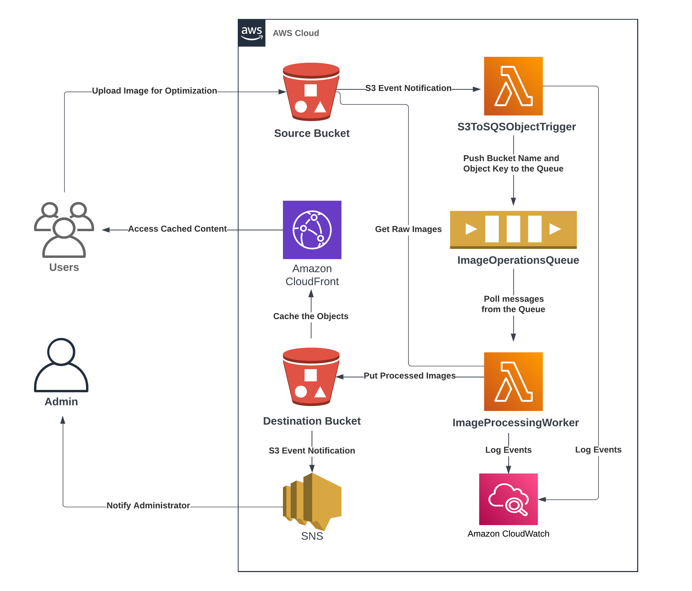

# Effortless Image Optimization at Scale: A Serverless Cloud Application

This repository contains the code for a Serverless Cloud Application that leverages various AWS services for image processing and optimization.

## The application architecture involves the following AWS components

**S3**: Used for storing the uploaded images and optimized images.
**Lambda**: Serverless functions that handle the processing and optimization of the images.
**SQS**: A FIFO queue for passing messages between Lambda functions.
**CloudFront**: Configured with an Origin Access Identity (OAI) to serve the optimized images from the destination S3 bucket.
**CloudWatch**: Provides monitoring and logging capabilities for the application.

## Application Workflow

1. User uploads an image to an S3 bucket.
2. The func1 Lambda function is triggered by S3 Object Creation Events and sends a message containing the bucket name and object ID to the SQS FIFO queue.
3. The func2 Lambda function polls the queue for messages and retrieves the image from the source bucket.
4. Image optimization and processing are performed by func2.
5. The optimized image is stored in the destination S3 bucket.
6. The destination bucket is configured with CloudFront and OAI, ensuring efficient and secure delivery of the optimized images.
7. For detailed implementation steps and code examples, please refer to my blog post where I provide a comprehensive guide on setting up and deploying this Serverless Cloud Application.

Feel free to explore the repository and provide any feedback or contributions. I would love to hear from you!
